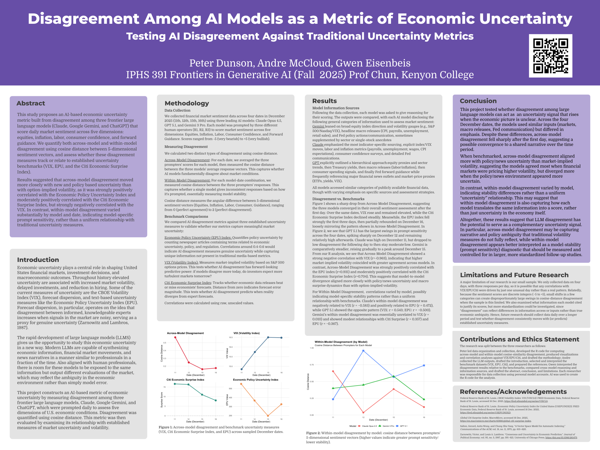

# Disagreement Among AI Models as a Metric of Economic Uncertainty

[](https://opensource.org/licenses/MIT)
[](https://www.r-project.org/)

> Testing whether disagreement among frontier large language models can serve as a complementary signal of U.S. economic uncertainty

<p align="center">
  
  <br>
</p>

---

**Authors:** Peter Dunson, Andre McCloud, Gwen Eisenbeis  
**Institution:** Kenyon College, IPHS 391 Frontiers in Generative AI (Fall 2025)  
**Advisor:** Prof. Chun

---

## 📋 Table of Contents

- [Overview](#overview)
- [Research Question](#research-question)
- [Key Findings](#key-findings)
- [Methodology](#methodology)
- [Data](#data)
- [Installation & Usage](#installation--usage)
- [Results](#results)
- [Limitations](#limitations)
- [Future Work](#future-work)
- [References](#references)
- [Contributing](#contributing)
- [License](#license)

---

## Overview

Economic uncertainty is a critical driver of financial markets, investment decisions, and macroeconomic outcomes. Traditional measures include the VIX (option-implied volatility), Economic Policy Uncertainty Index (EPU), and forecast dispersion among expert economists.

This project explores a novel approach: **using disagreement among state-of-the-art large language models as a proxy for economic uncertainty**. We leverage the fact that LLMs can rapidly synthesize vast amounts of economic data, financial market movements, and news—similar to human analysts—and that divergence in their assessments may reflect genuine ambiguity in the economic environment rather than mere model error.

### Models Tested
- **Claude Opus 4.5** (Anthropic)
- **GPT 5.1** (OpenAI)  
- **Gemini 3 Pro** (Google)

### Dimensions Evaluated
Each model scored U.S. market sentiment across five macro dimensions on a -5 (bearish) to +5 (bullish) scale:
1. **Equity Markets** - S&P 500/NASDAQ outlook
2. **Inflation Trajectory** - Price pressures and cooling dynamics
3. **Labor Strength** - Employment and wage trends
4. **Consumer Confidence** - Spending and sentiment
5. **Forward Guidance** - Federal Reserve policy signals

---

## Research Question

**Can disagreement among frontier LLMs serve as a meaningful metric of economic uncertainty that complements traditional benchmarks?**

Building on the economics literature showing that forecast dispersion among experts rises with uncertainty (Zarnowitz & Lambros, 1987), we hypothesize that LLM disagreement may similarly capture periods when economic signals are noisy or ambiguous.

---

## Key Findings

### Across-Model Disagreement
- **Strong positive correlation with EPU** (r = 0.931): Models diverged more when policy/news uncertainty was high
- **Strong negative correlation with VIX** (r = -0.963): Models agreed more when market volatility was elevated
- **Moderate positive correlation with Citi Economic Surprise Index** (r = 0.704)

**Interpretation:** LLM disagreement appears to capture *narrative and policy ambiguity* distinct from option-implied volatility, suggesting it measures a complementary dimension of uncertainty.

### Within-Model Disagreement
- Varied substantially by model, indicating differences in **prompt sensitivity** and model stability
- GPT 5.1 showed the highest prompt sensitivity (largest swings across prompters)
- Claude Opus 4.5 exhibited high initial disagreement that stabilized
- Gemini 3 Pro demonstrated the most consistent responses across prompters

**Interpretation:** Within-model disagreement is better understood as a *model-stability diagnostic* rather than a pure uncertainty signal.

---

## Methodology

### 1. Data Collection

We collected daily market sentiment assessments across four dates in December 2025 (11th, 12th, 15th, 16th):
- **3 models** × **3 human prompters** × **4 dates** = 36 total responses
- Each prompter independently queried each model at approximately 7-8 PM EST
- Models provided integer scores from -5 to +5 across five dimensions

### 2. Prompt Design

Our standardized prompt positioned the LLM as:
> "A senior macro-focused financial market strategist responsible for synthesizing economic data, market behavior, and policy signals"

The prompt instructed models to analyze:
- Major indices (S&P 500, VIX)
- Bond yields (10-Year Treasury)
- Top financial headlines (WSJ, Bloomberg, CNBC)
- Recent 24-hour developments

See [`prompt.txt`](prompt.txt) for the full prompt.

### 3. Disagreement Metrics

We constructed 5-dimensional sentiment vectors for each response:

```
x = (equities, inflation, labor, consumer, guidance)
```

**Cosine Distance** was used to quantify disagreement:
- **0** = Perfect agreement
- **2** = Perfect disagreement

#### Across-Model Disagreement
1. Average the three prompters' responses within each model
2. Calculate pairwise cosine distances between model vectors
3. Aggregate (mean) into a single daily disagreement score

#### Within-Model Disagreement
1. For each (model, date) pair, calculate cosine distances across prompters
2. Aggregate pairwise distances to measure prompt sensitivity

### 4. Benchmark Comparison

We compared our metrics against three established uncertainty measures using **raw, unscaled values**:

| Benchmark | Source | Interpretation |
|-----------|--------|----------------|
| **VIX** | CBOE/FRED | Market-implied volatility (30-day forward) |
| **EPU Index** | Baker, Bloom & Davis | Policy uncertainty from news text analysis |
| **Citi Economic Surprise** | Citigroup/MacroMicro | Economic data vs. forecast deviations |

---

## Data

### Repository Structure

```
iphs_391_final_project_market_uncertainty/
├── README.md
├── prompt.txt                                        # Standardized LLM prompt
├── iphs_391_final_project_market_uncertainty.Rproj  # RStudio project file
├── assets/
│   └── poster_thumbnail.png                         # Poster preview image
├── code/
│   └── cosine_similarity.R                          # Main analysis script
└── data/
    ├── llm_response.csv                             # LLM sentiment scores
    └── comparison_metrics.csv                       # Benchmark uncertainty indices
```

All data files are stored in the `data/` directory.

### Data Files

- **`llm_response.csv`** - Daily sentiment scores from each model-prompter combination
- **`comparison_metrics.csv`** - Traditional uncertainty benchmarks (VIX, EPU, Citi Economic Surprise Index)

---

## Installation & Usage

### Prerequisites
```r
# Required R packages
install.packages(c("dplyr", "tidyr", "lsa", "ggplot2", "pheatmap", "gridExtra"))
```

### Running the Analysis

1. **Clone the repository:**
```bash
git clone https://github.com/peterdunson/iphs_391_final_project_market_uncertainty.git
cd iphs_391_final_project_market_uncertainty
```

2. **Execute the R script:**
```r
source("code/cosine_similarity.R")
```

This will:
- Load the LLM responses and benchmark data
- Calculate across-model and within-model disagreement
- Generate correlation matrices
- Produce publication-quality visualizations

### Output Visualizations

The script generates key plots:
1. **Across-model disagreement over time** (line chart)
2. **Within-model disagreement by model** (multi-line chart)
3. **2×2 panel comparing disagreement with VIX, EPU, and Citi Surprise**
4. **Correlation heatmaps** for both disagreement types

---

## Results

### Visual Summary

Our analysis revealed a striking pattern: across-model disagreement **dropped sharply after December 11**, suggesting the models converged toward a shared narrative over the sampled period. This convergence occurred even as traditional volatility measures showed different trajectories.

### Correlation Analysis

**Across-Model Disagreement:**
```
VIX:                r = -0.963  (strong negative)
EPU Index:          r =  0.931  (strong positive)
Citi Surprise:      r =  0.704  (moderate positive)
```

**Within-Model Disagreement (varies by model):**

| Model | VIX | EPU | Citi Surprise |
|-------|-----|-----|---------------|
| Claude Opus 4.5 | -0.583 | 0.472 | 0.322 |
| GPT 5.1 | 0.543 | -0.500 | -0.197 |
| Gemini 3 Pro | 0.010 | -0.367 | 0.357 |

These varied correlations suggest that within-model disagreement (prompt sensitivity) differs substantially by model and does not show a uniform relationship with traditional uncertainty measures. Claude's within-model disagreement shows positive correlations with both EPU and Citi Surprise, while GPT shows opposite patterns, and Gemini shows minimal sensitivity to VIX.

### Information Sources

When asked to explain their reasoning, models disclosed different emphasis patterns:

- **Gemini:** Broad index movements, volatility gauges, headline macro releases, sector anecdotes
- **Claude:** Highly specific indicators, detailed Fed communications, explicit labor/inflation metrics
- **GPT:** Hierarchical approach starting with equities → yields → macro → consumer → Fed guidance

All models accessed similar public data but weighted sources differently, potentially contributing to observed disagreement.

---

## Limitations

1. **Small Sample Size**
   - Only 4 days of data with 3 responses per day
   - Correlations may be driven by outliers or spurious patterns
   - Statistical power is limited for robust inference

2. **Discrete Scoring**
   - Integer scale (-5 to +5) can create large cosine distance swings with small categorical shifts
   - Continuous scoring might provide more nuanced disagreement measures

3. **Information Differences**
   - Some disagreement may reflect differences in information access or sourcing rather than true economic ambiguity
   - Models may have different data cutoff times or access to different news sources

4. **Temporal Coverage**
   - Data collected over 4 dates spanning 6 days in December 2025 (11th, 12th, 15th, 16th)
   - Limited to a single economic regime (no recession, crisis, or major policy shift)

---

## Future Work

1. **Extended Time Series**
   - Daily data collection over 6-12 months to establish robust patterns
   - Test whether disagreement *predicts* future volatility or surprises (lead-lag relationships)

2. **Standardized Information Sets**
   - Control for information differences by providing identical data inputs
   - Isolate true model disagreement from information asymmetry

3. **Expanded Model Coverage**
   - Include additional frontier models (e.g., DeepSeek, Llama, Mistral)
   - Test whether disagreement scales with model diversity

4. **Continuous Scoring**
   - Allow decimal responses for finer granularity
   - Reduce sensitivity to integer rounding effects

5. **Real-Time Implementation**
   - Build automated pipeline for daily disagreement tracking
   - Create public dashboard for monitoring AI-based uncertainty metrics

6. **Causal Analysis**
   - Use natural experiments (Fed announcements, major data releases) to test whether disagreement spikes predictably around uncertain events

---

## References

1. **Baker, S. R., Bloom, N., & Davis, S. J.** (2016). Measuring economic policy uncertainty. *The Quarterly Journal of Economics*, 131(4), 1593-1636.

2. **Federal Reserve Bank of St. Louis.** CBOE Volatility Index: VIX (VIXCLS). FRED Economic Data, accessed 16 Dec. 2025, https://fred.stlouisfed.org/series/VIXCLS

3. **Federal Reserve Bank of St. Louis.** Economic Policy Uncertainty Index for United States (USEPUINDXD). FRED Economic Data, accessed 16 Dec. 2025, https://fred.stlouisfed.org/series/USEPUINDXD

4. **MacroMicro.** Global Citi Surprise Index, accessed 16 Dec. 2025, https://en.macromicro.me/charts/45866/global-citi-surprise-index

5. **Salton, G., Wong, A., & Yang, C. S.** (1975). A vector space model for automatic indexing. *Communications of the ACM*, 18(11), 613-620.

6. **Zarnowitz, V., & Lambros, L. A.** (1987). Consensus and uncertainty in economic prediction. *Journal of Political Economy*, 95(3), 591-621. https://doi.org/10.1086/261473

---

## Contributing

This project was completed as part of IPHS 391 at Kenyon College. While the research phase is complete, we welcome:

- **Replication studies** with extended time horizons
- **Methodological refinements** (alternative distance metrics, aggregation methods)
- **Extensions** to other domains (geopolitical risk, climate uncertainty, etc.)

If you build upon this work, please cite:
```
Dunson, P., McCloud, A., & Eisenbeis, G. (2025). Disagreement Among AI Models 
as a Metric of Economic Uncertainty. IPHS 391, Kenyon College.
```

---

## Author Contributions

- **Peter Dunson:** Data organization and collection, R code development (cosine similarity analysis, visualization, correlation analysis), methodology section
- **Andre McCloud:** LLM data collection, introduction section, benchmark dataset selection and interpretation (VIX, EPU, Citi), references
- **Gwen Eisenbeis:** Results interpretation, model reasoning comparison, abstract, conclusion, and limitations sections

**AI Usage:** R code for statistical analysis was developed with AI assistance.

---

## License

MIT License - See [LICENSE](LICENSE) for details.

---

## Acknowledgments

Special thanks to Prof. Chun for guidance throughout this project and to the IPHS 391 cohort for valuable feedback during development.

For questions or collaboration inquiries, please open an issue or reach out to the authors.

---

**Project Repository:** https://github.com/peterdunson/iphs_391_final_project_market_uncertainty  
**Data Spreadsheet:** https://docs.google.com/spreadsheets/d/1zrD3A2Sjjg0EfK6Gnwnm2s6zW8DXU8jXz-00eAS0Nqw/edit
